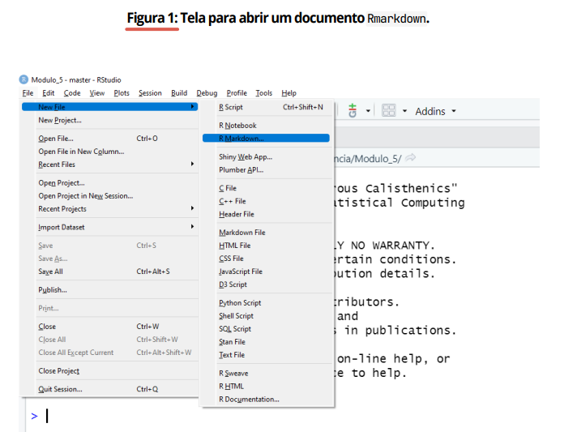
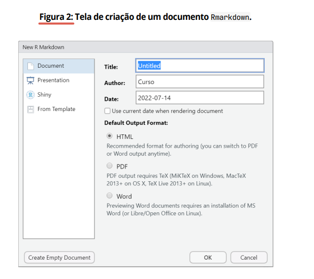
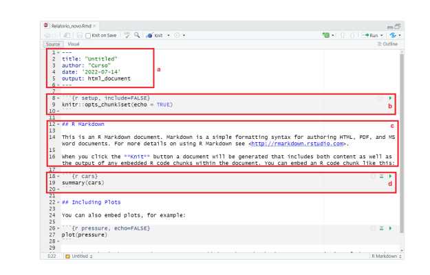
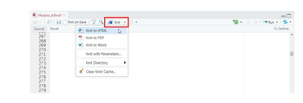
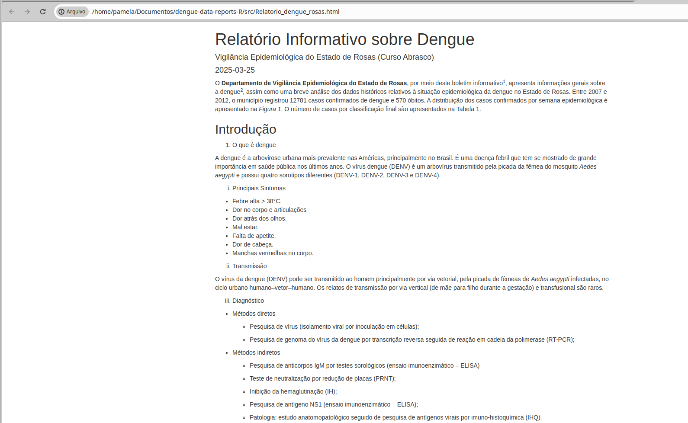
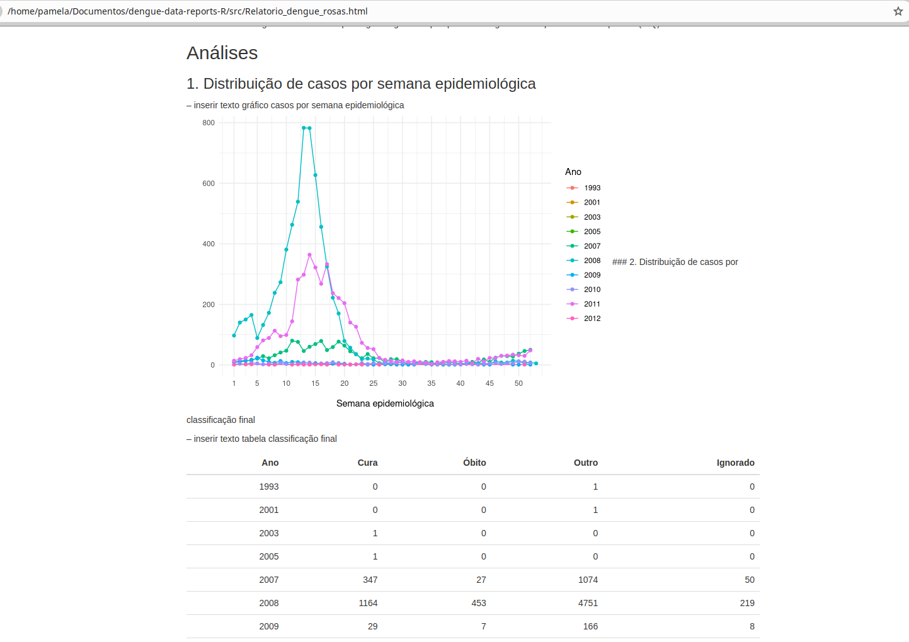

# Produção Automatizada de Relatórios na Vigilância em Saúde (Dengue) com linguagem R

Este repositório contém scripts e recursos para a geração automatizada de relatórios sobre a vigilância epidemiológica da dengue utilizando a linguagem R. O projeto visa facilitar a análise e visualização de dados por meio de relatórios dinâmicos, gráficos e dashboards interativos.

# Principais funcionalidades:

*   Processamento e limpeza de dados epidemiológicos.

*   Geração de relatórios automatizados em R Markdown.

*   Visualização interativa de dados com gráficos e tabelas.

*   Análises estatísticas e espaciais relacionadas à incidência da dengue.


# Transformando suas análises de dados em relatórios automatizados

1. utilizar o Rmarkdown para automatizar a produção de relatórios;
2. organizar suas rotinas de análises em relatórios dinâmicos (interativos);
3. criar relatórios com análises complexas;
4. salvar seus relatórios no formato .pdf, .html, e .docx de forma mais ágil.

# 1 Como escrever um relatório automatizado?

A produção diária de relatórios na vigilância em saúde pode ser desgastante devido à alta demanda e urgência das solicitações vindas de diferentes setores. Durante períodos críticos, como epidemias de dengue ou a pandemia de COVID-19, a necessidade de respostas rápidas exigiu métodos eficientes para estruturar e automatizar análises.

Este curso ensina como automatizar a geração de relatórios utilizando R e R Markdown, permitindo a criação de documentos dinâmicos com gráficos e tabelas gerados automaticamente. A metodologia aprendida pode ser aplicada a qualquer análise diária, garantindo rapidez e precisão na produção dos relatórios.

# Tecnologias utilizadas:

*   R Markdown → Criação de relatórios automatizados e dinâmicos.

*   ggplot2 → Visualização de dados com gráficos personalizáveis.

*   dplyr → Manipulação e transformação de dados de forma eficiente.

*   tidyr → Organização e limpeza de dados.

*   knitr → Renderização de relatórios em diferentes formatos (HTML, PDF, Word).

Essa abordagem permite gerar relatórios rapidamente, garantindo consistência e qualidade na apresentação dos dados epidemiológicos.

# 1.1 O que é o Rmarkdown?

 **R Markdown** é uma ferramenta poderosa que permite a criação de relatórios, documentos e apresentações diretamente a partir dos **scripts em R**. Ele combina a linguagem Markdown (para formatação de texto) com códigos R, permitindo a geração automatizada de documentos dinâmicos.

**Principais características:**

✅ Automatização de relatórios → Integra códigos R com texto formatado.

✅ Geração de múltiplos formatos → Exporta para .html, .pdf, .docx e outros.

✅ Reprodutibilidade → Facilita a atualização automática de análises e gráficos.

✅ Flexibilidade → Permite a criação de dashboards, websites e até livros.

**Aplicação na Vigilância em Saúde**
O R Markdown é extremamente útil para profissionais que precisam produzir e atualizar relatórios epidemiológicos de forma rápida e eficiente. Ele facilita a exportação automatizada de análises, gráficos e tabelas, garantindo respostas ágeis às demandas da população e gestores.


# 2 Como criar um arquivo Rmarkdown?

Antes de automatizar relatórios, é necessário criar um arquivo R Markdown no RStudio. Siga os passos abaixo:

1️. Abra o RStudio no seu computador.
2️. No menu superior, clique em:

*   **File (Arquivo) → New File (Novo Arquivo) → R Markdown...**

3️. Escolha um título e o formato de saída desejado (HTML, PDF ou Word).

4️. Clique em OK para criar o arquivo.

Agora, seu documento R Markdown está pronto para ser editado e utilizado na automação dos seus relatórios! 🚀


<div align="center">
    <div style="display: flex; align-items: center;">
        
    </div>
</div>
<br> 
<br>
Após criar um documento Rmarkdown, abrirá em seu RStudio uma nova janela com opções de criação de novos projetos. Nesta janela são inseridos os dados básicos do documento. Em seu computador insira o título, o nome do autor e a data
do seu painel.

<br>
<div align="center">
    <div style="display: flex; align-items: center;">
        
    </div>
</div>
<br> 

<br>

Observe que há um painel à esquerda da janela que se abriu. Nele, você terá disponível
quatro opções:
1. Document ou documento.
2. Presentation ou apresentação.
3. Shiny que é um pacote do R para criação de tabelas dinâmicas (animadas).
4. From Template local em que você poderá selecionar um modelo pré-existente.

<div align="center">
    <div style="display: flex; align-items: center;">
        
    </div>
</div>
<br> 
<br> 

 Partes  | Descrição               | 
| ------  | :-----------------------: | 
|  A  | O cabeçalho YAML define os metadados do documento e é delimitado por três hífens (---). Ele contém informações como título, autor, data e formato de saída do relatório.| 
| B | Os code chunks são trechos de código em R dentro do R Markdown. Eles são delimitados por três acentos graves (```) e podem incluir opções dentro de chaves ({}) para personalizar a execução do código.
| C | No R Markdown, o texto e os títulos seguem a sintaxe Markdown, permitindo a edição de títulos, parágrafos, listas e imagens no relatório final.
| D | No R Markdown, os trechos de código são escritos entre três acentos graves (```) e devem incluir {r} logo após para indicar que o código será executado em R. 

<br> 

# Cabeçalho YAML no R Markdown

Explicação dos campos:
1.   title: Define o título do relatório.
2.   author: Nome do autor ou instituição.
3.   date: Define a data do relatório (pode ser dinâmica com r Sys.Date()).
4.   output: Formato do documento final (html_document, pdf_document ou word_document).


```R
---
title: "Relatório Epidemiológico da Dengue"
author: "Nome do Autor"
date: "`r Sys.Date()`"
output: html_document
---

```

# Trechos de Código (Code Chunks) no R Markdown


```R 

{r}
# Criando um gráfico de casos de dengue
library(ggplot2)
dados <- data.frame(semana = 1:10, casos = c(5, 8, 15, 20, 30, 45, 50, 65, 80, 100))
ggplot(dados, aes(x = semana, y = casos)) + 
  geom_line() + 
  labs(title = "Evolução dos Casos de Dengue")


### **Personalizando um Code Chunk**  
Podemos adicionar opções dentro das **chaves (`{}`)** para configurar a exibição do código e seus resultados.  

#### **Principais Opções:**  
✅ `echo=FALSE` → **Oculta** o código no relatório, mostrando apenas o resultado.  
✅ `eval=FALSE` → **Impede a execução** do código.  
✅ `message=FALSE` → Oculta **mensagens** geradas pelo código.  
✅ `warning=FALSE` → Oculta **avisos** do R.  

#### **Exemplo com Opções:**  
```r
```{r setup, echo=FALSE, message=FALSE, warning=FALSE}
# Configuração inicial do relatório
library(knitr)
opts_chunk$set(echo = TRUE, message = FALSE, warning = FALSE)

```

# Textos e Títulos no R Markdown

1.  Títulos e Subtítulos:

Os títulos são criados usando hashtags (#), onde mais # indicam um título de nível inferior.

``` R

# Título Principal (Nível 1)
## Subtítulo (Nível 2)
### Seção menor (Nível 3)
#### Sub-seção (Nível 4)


```
2. Parágrafos e Ênfase

*   Negrito: **texto em negrito** → texto em negrito

*   Itálico: *texto em itálico* → texto em itálico

*   Código inline: `código` → código


3. Listas

```R
#  Lista não numerada:
- Item 1
- Item 2
  - Subitem 2.1
  - Subitem 2.2


#  Lista numerada:
1. Primeiro item  
2. Segundo item  
   1. Subitem  
   2. Subitem  


```

4. Inserindo Imagens

```R


```

5. Inserindo Links

```R

[Texto do Link](https://www.exemplo.com)

```

# Exemplo Completo no R Markdown


```R

# Relatório Epidemiológico da Dengue  

## Introdução  
Este relatório apresenta a situação da dengue com base nos dados mais recentes.  

## Dados e Análises  
- **Total de casos registrados:** 1.500  
- **Incidência por bairro:** Veja a tabela abaixo.  

## Gráfico da Evolução da Dengue  
Veja o gráfico atualizado da série histórica de casos.  

  

```

o **RStudio**, o botão **Knit** é usado para renderizar um documento R Markdown para diferentes formatos, como **HTML, PDF ou Word**. Ele está localizado na parte superior do editor, geralmente ao lado dos botões Run e Save.

### Onde encontrar o botão Knit?

*   Abra o RStudio.

*   Crie ou abra um arquivo R Markdown (.Rmd).

*   Na barra de ferramentas superior, procure pelo botão "Knit" (ícone de uma bola de lã com agulhas).

*   Clique no botão "Knit" e selecione o formato desejado (HTML, PDF, Word, etc.).

*   O relatório será gerado e salvo automaticamente.

<br>
<div align="center">
    <div style="display: flex; align-items: center;">
        
    </div
</div>
<br> 


### Alternativa via código

```R

rmarkdown::render("seu_arquivo.Rmd")

```


<br>
<div align="center">
    <div style="display: flex; align-items: center;">
        
    </div
</div>
<br> 

<br>
<div align="center">
    <div style="display: flex; align-items: center;">
        
    </div
</div>
<br> 


# resultado 

| Código  | PDF do Relatorio | 
| ------  | :-----------------------: 
| [Codigo.Rmd](https://github.com/pamelamontteiro/dengue-data-reports-R/blob/main/src/Relatorio_dengue_rosas.Rmd)| [Relatorio de casos da Dengue](https://github.com/pamelamontteiro/dengue-data-reports-R/blob/main/src/Relatorio_dengue_rosas.pdf)